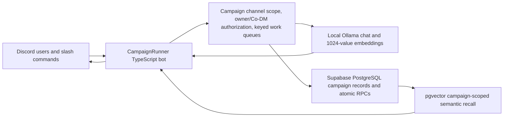

# CampaignRunner Executive Summary

**Document status:** Living project reference  
**Last updated:** August 14, 2026  
**Current delivery:** Phase 6 — Campaign Memory Toolkit and Co-DM Control

## Project overview

CampaignRunner is a local-first Discord co-pilot for human Dungeon Masters. It keeps structured campaign continuity in Supabase, retrieves relevant campaign memories with pgvector, and uses local Ollama models to answer questions, extract durable events, and build session and campaign summaries.

The design deliberately separates temporary conversation from campaign truth:

- Recent Discord messages are soft context only.
- Campaigns, sessions, characters, locations, events, participants, and summaries stored in Supabase are authoritative.
- Chat and embedding inference run through local Ollama. There is no cloud LLM fallback.
- Every query and mutation is scoped to the campaign bound to the current Discord guild and channel.

CampaignRunner is intended to reduce DM bookkeeping without replacing the DM. The owner and authorized Co-DMs retain explicit control over durable memory.

## What customers can do

### Run a grounded campaign co-pilot

An owner binds a campaign to a Discord channel and starts a session. During an active session, players or DMs can mention the bot—or reply to one of its messages—to ask campaign questions. The bot combines authoritative campaign records, campaign-scoped semantic recall, and recent conversational context before answering.

After a successful turn, CampaignRunner can extract durable events, character updates, and location updates. Low-value or low-confidence results are discarded, known entity names are normalized to their canonical campaign spelling, and accepted event confidence is stored for later inspection.

### Share control safely

The campaign owner can add or remove Discord users as Co-DMs. Owners and Co-DMs can run campaign mutations; only the owner can manage the Co-DM allowlist. Public inspection commands remain available to anyone in the bound channel.

Co-DM IDs are stored in `campaigns.settings.codm_discord_ids`. Updates are atomic, deduplicated, validate Discord snowflakes, preserve unrelated settings, and verify ownership again inside the database update.

### Inspect and repair memory

Customers can browse a chronological timeline, semantically recall events, filter recall by participant/session/importance, edit event text, safely preview query-based deletion, delete exact events, and link or unlink canonical characters and locations. Text edits immediately invalidate stale vectors and derived summaries, then re-embed asynchronously with bounded retries.

### Rebuild grounded summaries

Session summaries use only authoritative event/entity/summary rows and must follow the structure `Recap`, `Key Outcomes`, and `Active Threads`. Campaign rollups use stored completed-session summaries and key events within a fixed token budget.

`/memory regenerate-summary` can rebuild the active session, the most recently ended session when none is active, the campaign rollup, or both in sequence. Regeneration updates summaries without changing session lifecycle state.

## Discord command catalog

Permission terms:

- **Public:** anyone in the bound server channel.
- **Mutator:** campaign owner or an authorized Co-DM.
- **Owner:** the Discord user who created the campaign binding.

| Command | Permission | Customer use |
| --- | --- | --- |
| `/ping` | Public | Check Discord responsiveness and local Ollama health. |
| `/campaign create name:` | Any user in an unbound channel | Create a campaign, bind it to the channel, and become its owner. |
| `/campaign info` | Public | Show campaign identity, owner, entity counts, and session state. |
| `/session start` | Mutator | Start the active play session and enable co-pilot turns. |
| `/session end` | Mutator | Generate and atomically save session/campaign summaries, then end the session. |
| `/memory status` | Public | Show character, location, event, and session counts plus the latest event/confidence. |
| `/memory timeline [limit:] [session:]` | Public | Show recent events newest-first; default 10, maximum 25. |
| `/memory recall query: [entity:] [session:] [min_importance:]` | Public | Semantic search over campaign events with optional exact participant, session, and importance filters. |
| `/memory edit id: [summary:] [text:]` | Mutator | Correct event summary/detail text, invalidate stale derivatives, and refresh its search vector. |
| `/memory forget id:` | Mutator | Permanently delete one exact campaign event and invalidate derived summaries. |
| `/memory forget query: [confirm:]` | Mutator | Preview up to 10 matches; rerun with `confirm:true` to delete the current matches and return exact deleted IDs. |
| `/memory link id: [character:] [location:]` | Mutator | Add canonical campaign character/location names to an event’s participants. |
| `/memory unlink id: [character:] [location:]` | Mutator | Remove canonical campaign character/location names from an event’s participants. |
| `/memory regenerate-summary target:` | Mutator | Rebuild `session`, `campaign`, or `both` summary levels from stored campaign records. |
| `/npc add name: [description:]` | Mutator | Add an NPC. |
| `/npc update name: [description:] [status:]` | Mutator | Update one exact-name NPC. |
| `/npc list` | Public | List stored NPCs and their current status/details. |
| `/location add name: [description:]` | Mutator | Add a location. |
| `/location update name: description:` | Mutator | Correct one exact-name location. |
| `/location list` | Public | List stored campaign locations. |
| `/codm add user:` | Owner | Authorize a Discord user as a Co-DM. |
| `/codm remove user:` | Owner | Revoke a user’s Co-DM authorization immediately. |
| `/codm list` | Owner | Privately list authorized Co-DM mentions and IDs. |

Mutation commands use ephemeral Discord replies. Unauthorized users receive a clear distinction between “owner required” and “owner or Co-DM required.”

## Typical customer workflow

1. In the campaign’s intended text channel, run `/campaign create name:<campaign name>`.
2. Optionally authorize assistant DMs with `/codm add user:<user>` and confirm with `/codm list`.
3. Add known NPCs and locations, or allow validated extraction to build them over time.
4. Run `/session start` before play.
5. Mention the bot with a campaign question, or reply to one of its answers to continue the thread.
6. Use `/memory timeline`, `/memory recall`, `/npc list`, and `/location list` to inspect continuity.
7. Correct drift with `/memory edit`, `/memory link`, `/memory unlink`, entity updates, or the two-step forget workflow.
8. Run `/session end` after play to save grounded session and campaign summaries.
9. Use `/memory regenerate-summary target:both` when summaries need to be rebuilt from current authoritative records.
10. Revoke shared control with `/codm remove` when it is no longer needed.

## Architecture and data flow

Key implementation boundaries:

- **Discord layer:** command schemas, message mention/reply triggers, ephemeral mutation feedback, safe output formatting.
- **Service/domain layer:** validation, campaign authorization, extraction thresholds, summary orchestration, retry policy, and serialized per-channel mutations.
- **Local inference layer:** Ollama chat and embeddings only; no cloud model fallback.
- **Persistence layer:** Supabase PostgreSQL, RLS-enabled tables, campaign-scoped queries, pgvector HNSW recall, and atomic mutation functions.
- **Embedding contract:** `qwen3-embedding:0.6b` with `vector(1024)` throughout events, summaries, search RPCs, and re-embedding paths.

## Memory quality, safety, and recovery

- Event extraction defaults to importance `70`, event confidence `0.75`, and entity confidence `0.80`; all are process-level environment settings.
- Extraction prompts receive authoritative known character/location names. Matching is case-insensitive and stored using canonical campaign casing.
- Invalid, low-importance, and low-confidence extractions are dropped with structured reasons that do not log prompt content.
- Semantic recall never crosses campaign boundaries and requires the configured embedding model marker.
- Filtered recall searches a wider candidate pool of 50 before applying exact filters and returning the configured top count.
- Event edits atomically null stale embeddings and invalidate session/campaign summaries before background re-embedding.
- Query-based forget is preview-first, re-searches at confirmation time, and deletes at most 10 events.
- Summary prompts use explicit authoritative-data boundaries and treat stored strings as data, not instructions.
- Session end is atomic: if summary persistence cannot be confirmed, the session remains active for a safe retry.
- Co-DM updates are owner-checked inside the same database operation that changes JSON settings.

## Installation and operation

### Requirements

- Windows 10 or 11
- Node.js 24 or newer
- Discord application/bot with Message Content Intent enabled
- Supabase project
- Ollama for Windows
- Local chat model such as `qwen3.5:4b`
- `qwen3-embedding:0.6b` unless a deliberate full embedding migration is performed

### Initial setup

1. Run `npm ci`.
2. Copy `.env.example` to `.env` and provide Discord/Supabase credentials.
3. Pull the configured Ollama chat and embedding models.
4. Apply every executable SQL file in `supabase/migrations` in filename order. The `000` file is a comments-only placeholder.
5. Run `npm run typecheck`, `npm run typecheck:tests`, `npm test`, and `npm run build`.
6. Start development mode with `npm run dev`, or run compiled output with `npm start` after a build.

The Windows host must remain powered on, awake, online, and running both Ollama and CampaignRunner. The application is not installed as a Windows service. Run only one process for a bot identity because rate limits and keyed queues are process-local.

### Important configuration

| Variable | Purpose / default |
| --- | --- |
| `DISCORD_TOKEN` | Server-only bot token. |
| `DISCORD_CLIENT_ID` | Discord application ID. |
| `DISCORD_GUILD_ID` | Optional development guild for immediate command registration. |
| `SUPABASE_URL` | Supabase project URL. |
| `SUPABASE_SERVICE_ROLE_KEY` | Server-only elevated key; never expose it to clients. |
| `OLLAMA_BASE_URL` | Local OpenAI-compatible endpoint; default `http://127.0.0.1:11434/v1`. |
| `OLLAMA_CHAT_MODEL` | Local response/extraction/summary model; default `qwen3.5:4b`. |
| `OLLAMA_EMBED_MODEL` | Embedding model; default `qwen3-embedding:0.6b`. |
| `PROMPT_TOKEN_BUDGET` | Maximum grounded prompt budget; default `6000`. |
| `RETRIEVAL_TOP_K` | Final semantic recall count; default `8`. |
| `EVENT_IMPORTANCE_THRESHOLD` | Minimum stored event importance; default `70`. |
| `EVENT_CONFIDENCE_THRESHOLD` | Minimum stored event confidence; default `0.75`. |
| `ENTITY_CONFIDENCE_THRESHOLD` | Minimum character/location confidence; default `0.80`. |

## Current limitations

- `copilot` is the only implemented campaign mode; `solo` is reserved and rejected explicitly.
- Discord direct messages are not supported.
- Ordinary messages do not trigger the bot; direct mention/reply plus an active session is required.
- Campaign deletion and NPC/location deletion commands are not part of the current command surface.
- Supabase is the durable store and may be cloud-hosted; “local-first” refers primarily to model inference and bot hosting.
- RLS has no end-user policies because only the trusted bot uses the service-role key. Direct client access requires a future authentication/policy design.
- A different embedding dimension requires a coordinated SQL/runtime migration and full re-embed. The current contract must remain `vector(1024)`.

## Validation status

As of August 14, 2026:

- 33 automated test files and 275 tests pass.
- Production typecheck, test typecheck, build, schema verification, and diff checks pass.
- All Supabase Phase 6 migrations are applied to the development project.
- Hosted RPC signatures for summary regeneration and Co-DM updates are verified.
- The integrated bot passed local Ollama health, registered seven guild commands, connected to Discord, and the live Discord registry reported the complete command/subcommand surface.
- Remaining human gate: use two Discord accounts in a disposable bound channel to add a Co-DM, perform a mutation/session start as that Co-DM, revoke access, and confirm the former Co-DM is immediately denied. The implementation is covered by automated owner/Co-DM/unprivileged permission matrices; the two-account UI smoke was unavailable in this session.

## Living update log

### August 14, 2026 — Phase 6

- Added event confidence storage and confidence-aware status/timeline/recall output.
- Added recent timeline browsing and filtered semantic recall.
- Added safe memory edit, exact/query forget, canonical participant link/unlink, async re-embedding, and summary invalidation.
- Added configurable extraction quality thresholds, known-entity grounding, canonical name normalization, and persisted confidence.
- Reworked session and campaign summary prompts for strict authoritative grounding and token budgets.
- Added session/campaign/both summary regeneration.
- Added atomic Co-DM allowlist storage, owner-only management commands, and owner-or-Co-DM mutation authorization.
- Applied and verified all Phase 6 migrations while preserving `vector(1024)`.

Update this document at the end of each future implementation session so its capabilities, commands, operating instructions, limitations, validation status, and dated change log remain current.
